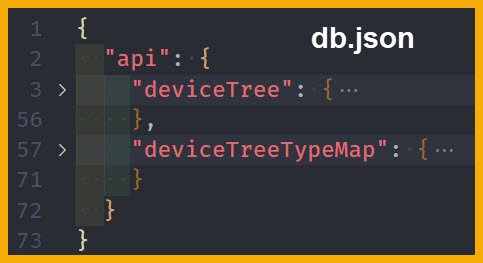
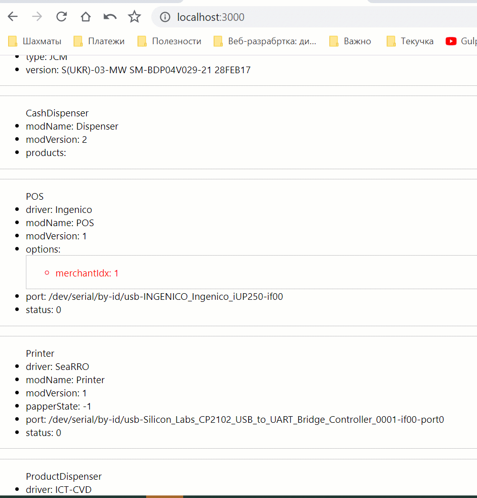

### Задание



Объект deviceTree содержит дерево устройство, которое нужно отобразить в пользовательском интерфейсе.

Некоторые элементы иерархии должны иметь возможность редактировать данные поля.

Структура deviceTreeTypeMap повторяет иерархию некоторых элементов deviceTree с указанием типов для конечных нод.

В примере имеется только тип number, присутствие данного типа должно указывать на то, что поле должно быть редактируемо, тип данных number(целочисленное значение)

---

### Реализация



---

======================================

# RACT-ADMIN

#### Устанавливаем JSON-server: get a full fake REST API with zero coding

```js
npm i json-server
npm i concurrently
```

package.json

```js
"proxy": "http://localhost:5000",

"start": "react-scripts start",

"server": "json-server --watcdb-json-server.json --port 5000",

"dev": "concurrently \"npm run start\" \"npm run server\" ",
```

#### Устанавливаем react-admin - a frontend Framework for building admin applications running in the browser on top of REST/GraphQL services, using ES6, [React](https://facebook.github.io/react/) and [Material Design](https://facebook.github.io/react/). Open sourced and maintained by [marmelab](https://marmelab.com/)

```js
npm i react-admin ra-data-simple-rest @material-ui/core
```

Проблему с пагинацией можно решить добавлением в json-server [middleware](https://www.npmjs.com/package/json-server#add-middlewares)

```js
// hello.js
module.exports = (req, res, next) => {
  res.header('Content-Range', 'CardReaders 0-10/10')
  next()
}

// package.json
"server": "json-server --watch db-json-server2.json
--port 5000 --middlewares ./src/range.js"
```
